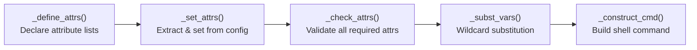
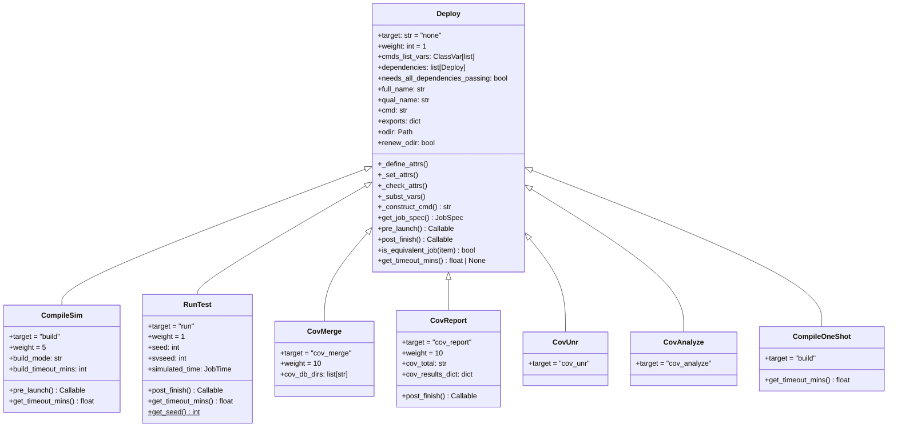

<!--
# Copyright lowRISC contributors (OpenTitan project).
# Licensed under the Apache License, Version 2.0, see LICENSE for details.
# SPDX-License-Identifier: Apache-2.0
-->

# Deploy Objects

← [job-data-models.md](job-data-models.md) | [job-abstractions.md](job-abstractions.md) | → [launchers.md](launchers.md)

This document explains how high-level HJSON configuration is transformed into concrete,
executable `JobSpec` objects via the `Deploy` class hierarchy.

**Source:** `src/dvsim/job/deploy.py`

---

## The Problem Deploy Solves

HJSON config is hierarchical, mutable, and tool-specific:
- It uses wildcard variables (`{build_mode}`, `{test}`, `{seed}`) that must be substituted.
- Attributes are scattered across multiple objects (`BuildMode`, `Test`, `SimCfg`).
- Tool-specific options (VCS vs. Xcelium vs. Verilator) vary per flow.

`JobSpec` must be the opposite: flat, immutable, and tool-agnostic. The `Deploy` class
hierarchy is the translation layer between these two worlds.

---

## The Five-Phase Initialization Pipeline

Every `Deploy.__init__` executes the same five phases in order:



### Phase 1: `_define_attrs()`

Declares two dictionaries (`mandatory_cmd_attrs` and `mandatory_misc_attrs`) that list all
attribute names this subclass needs, initialized to `False`. The base class declares a
minimal set; each subclass extends it via `super()._define_attrs()` + `update()`.

- `mandatory_cmd_attrs`: attributes that directly contribute to the shell command (e.g.
  `build_cmd`, `run_opts`, `proj_root`)
- `mandatory_misc_attrs`: attributes used for patterns, timeout, paths, etc. (e.g.
  `build_fail_patterns`, `build_timeout_mins`)

### Phase 2: `_set_attrs()`

Calls `_extract_attrs()` one or more times against different source dicts (typically the
`BuildMode.__dict__` or `Test.__dict__` first, then `SimCfg.__dict__`). The first matching
source wins for each attribute. Additionally sets derived attributes like `odir`,
`full_name`, `qual_name`, and `pass_patterns`/`fail_patterns`.

### Phase 3: `_check_attrs()`

Iterates over both attribute dictionaries and raises `AttributeError` for any that are still
`False` (i.e., were never found in any source dict). This gives a clear error before any
command is constructed.

### Phase 4: `_subst_vars()`

Performs two passes of wildcard substitution:
1. First pass: substitute `{var}` tokens using the instance's own `__dict__` as the source.
   Errors are ignored (some variables may not be resolved yet).
2. Second pass: substitute remaining `{var}` tokens using `sim_cfg.__dict__`. Errors here
   are fatal.

This two-pass approach resolves cross-referential wildcards (e.g. `{build_dir}` referencing
`{scratch_path}` which lives in `SimCfg`).

### Phase 5: `_construct_cmd()`

Builds the `make -f <flow_makefile> <target>` shell command by iterating over
`mandatory_cmd_attrs` in sorted order and appending `key=value` pairs. Lists are joined
with spaces (or `&&` for `cmds_list_vars` like `pre_build_cmds`). Booleans are coerced to
`0`/`1`. Strings are shell-quoted via `shlex.quote`.

---

## `get_job_spec()` — The Bridge to the Scheduler World

After construction, `get_job_spec()` is the **only public method** that exposes a `Deploy`
object to the scheduler. It instantiates a `JobSpec` from the fully-resolved instance
attributes, collecting provenance metadata from `sim_cfg`:

```python
def get_job_spec(self) -> JobSpec:
    return JobSpec(
        name=self.name,
        job_type=self.__class__.__name__,
        ...
        dependencies=[d.full_name for d in self.dependencies],
        cmd=self.cmd,
        pre_launch=self.pre_launch(),
        post_finish=self.post_finish(),
        ...
    )
```

Note that `pre_launch` and `post_finish` are called here (returning closures), not later.
This means the callbacks capture the `Deploy` object's state at `get_job_spec()` time.

---

## Pre-Launch and Post-Finish Callbacks

The base `Deploy` class provides no-op implementations of both callbacks. Subclasses
override them to hook into job lifecycle events:

```python
def pre_launch(self) -> Callable[[], None]:
    def callback() -> None:
        ...  # delete old coverage DB, etc.
    return callback

def post_finish(self) -> Callable[[JobStatus], None]:
    def callback(status: JobStatus) -> None:
        ...  # extract coverage summary, delete coverage data on failure, etc.
    return callback
```

These callbacks are stored in `JobSpec` and invoked by the launcher's `_pre_launch()` and
`_post_finish()` methods. They are the remaining coupling between the `Deploy` world and the
`Launcher` world — see the `# TODO` in `data.py` which notes the intent to refactor these
out eventually.

---

## Deploy Subclasses

### `CompileSim` (target: `build`, weight: 5)

Compiles the simulation executable (VCS/Xcelium/Verilator elaboration). This is the most
resource-intensive step: the default timeout is 60 minutes.

- **Extra config sources**: Reads from `BuildMode.__dict__` first, then `SimCfg.__dict__`.
- **Key attrs**: `build_cmd`, `build_opts`, `sv_flist_gen_cmd`, `pre_build_cmds`,
  `post_build_cmds`, `build_timeout_mins`.
- **`gui` mode**: Forced to `False` — you never compile in GUI mode.
- **`pre_launch`**: Deletes the old coverage database directory before recompiling (prevents
  stale coverage data from contaminating a new build).
- **`renew_odir`**: `False` — incremental compile reuses the same output directory.
- **Weight 5**: Build jobs are much slower than run jobs; allocating fewer slots to them
  gives run jobs a better chance of filling available parallelism.

### `RunTest` (target: `run`, weight: 1)

Runs a single simulation test at a specific seed. One `RunTest` is created per seed per
test.

- **Extra config sources**: Reads from `Test.__dict__` first.
- **Key attrs**: `run_cmd`, `run_opts`, `uvm_test`, `uvm_test_seq`, `seed`, `svseed`,
  `pre_run_cmds`, `post_run_cmds`, `run_timeout_mins`.
- **Seed**: Generated via `RunTest.get_seed()` — consumes from the `--seeds` list if
  provided, falls back to `--fixed-seed`, otherwise draws a 256-bit random value.
- **`qual_name`**: `run_dir_name + "." + str(seed)` — disambiguates multiple seeds of the
  same test.
- **`renew_odir`**: `True` — each seed run gets a fresh output directory (previous seeds
  are backed up).
- **`post_finish`**: Deletes `cov_db_test_dir` if the test failed (avoids polluting the
  merge database with data from a failed run).
- **`run_timeout_multiplier`**: An optional multiplier applied to `run_timeout_mins` for
  slow environments.

### `CovMerge` (target: `cov_merge`, weight: 10)

Merges individual per-test coverage databases into a single aggregate database.

- **Dependencies**: All `RunTest` objects in the regression. `needs_all_dependencies_passing`
  is set to `False` — coverage merge runs even if some tests failed, as long as at least one
  passed.
- **`cov_db_dirs`**: Assembled from all `RunTest` dependencies; the primary build mode's DB
  is placed first. If `--cov-merge-previous` is set, previous merged DBs are appended.
- **Weight 10**: Coverage merge jobs are fast; they should get plenty of slots to start
  immediately once tests complete.

### `CovReport` (target: `cov_report`, weight: 10)

Generates the HTML coverage report from the merged database.

- **Dependency**: The single `CovMerge` job.
- **`post_finish`**: Reads the coverage summary table from the report text file via the tool
  plugin and stores it in `cov_results_dict` for the dashboard.

### `CovUnr` (target: `cov_unr`)

Runs the Unreachability (UNR) analysis on the coverage database to distinguish code that is
genuinely unreachable from code that is merely uncovered. This informs exclusion files.

- **Input**: `cov_merge_db_dir` (depends on `CovMerge` having run).

### `CovAnalyze` (target: `cov_analyze`)

Launches the interactive coverage analysis GUI. Forces `sim_cfg.gui = True` before
construction so that no timeout is set.

### `CompileOneShot` (target: `build`)

Used by non-simulation flows (Formal, Lint, Synthesis, CDC, RDC). Similar to `CompileSim`
but includes `report_cmd`/`report_opts` for post-build report generation and does not
manage the coverage infrastructure.

---

## Class Diagram



---

## Initialization Pipeline (Process View)

```mermaid
flowchart LR
    subgraph "Phase 1: _define_attrs()"
        A1["Base: name, dry_run,\nexports, flow_makefile, build_mode"]
        A2["Subclass extends:\nadds job-specific attrs"]
        A1 --> A2
    end

    subgraph "Phase 2: _set_attrs()"
        B1["_extract_attrs(mode.__dict__)"]
        B2["_extract_attrs(sim_cfg.__dict__)"]
        B3["Derive: odir, full_name,\nqual_name, pass/fail patterns"]
        B1 --> B2 --> B3
    end

    subgraph "Phase 3: _check_attrs()"
        C1["Assert all mandatory\nattrs are True"]
    end

    subgraph "Phase 4: _subst_vars()"
        D1["Pass 1: self.__dict__\nerrors ignored"]
        D2["Pass 2: sim_cfg.__dict__\nerrors fatal"]
        D1 --> D2
    end

    subgraph "Phase 5: _construct_cmd()/_process_exports()"
        E1["make -f makefile target\nKEY=value ..."]
    end

    A2 --> B1
    B3 --> C1
    C1 --> D1
    D2 --> E1
```



---

## See Also

- [job-data-models.md](job-data-models.md) — `JobSpec` and other data models
- [launchers.md](launchers.md) — how the launcher receives and executes a `JobSpec`
- [scheduler.md](scheduler.md) — how the scheduler orchestrates `JobSpec` instances
- [job-abstractions.md](job-abstractions.md) — overview of all layers
